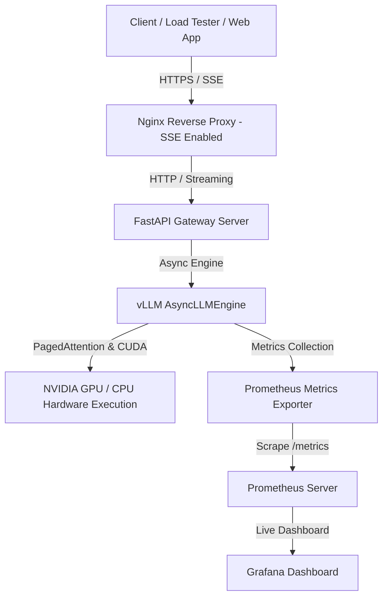

# Enterprise vLLM Production Inference Platform

A complete, production-ready LLM inference platform built from scratch to serve quantized open-source language models using **vLLM (`AsyncLLMEngine`)** on GPU-powered Google Cloud instances or local CPU/GPU devices.

Features an **OpenAI-compatible REST/SSE streaming API (FastAPI)**, containerized with **Docker**, secured & load-balanced with **Nginx**, monitored in real-time with **Prometheus & Grafana**, and benchmarked under concurrent load.

---

## 🏛️ System Architecture



---

## 📁 Repository Directory Structure

```
d:/Edutainer/vLLM/
├── app/
│   ├── main.py              # FastAPI entrypoint, lifespan manager, CORS, Prometheus endpoint
│   ├── config.py            # Platform configuration & Pydantic environment settings
│   ├── engine.py            # AsyncLLMEngine core wrapper with SSE streaming & TTFT/TPOT tracking
│   ├── router.py            # OpenAI-compatible API routes (/v1/chat/completions, /v1/models)
│   ├── metrics.py           # Custom Prometheus metrics definitions (TTFT, TPOT, KV Cache %)
│   └── schemas.py           # Pydantic schemas matching OpenAI API format
├── docker/
│   ├── Dockerfile           # Production CUDA 12.1 GPU Dockerfile (PyTorch + vLLM + FastAPI)
│   ├── Dockerfile.cpu       # Production CPU Dockerfile for local x86_64 execution
│   └── docker-compose.yml   # Multi-service stack (vLLM API, Nginx, Prometheus, Grafana)
├── nginx/
│   └── nginx.conf           # Enterprise Nginx proxy (proxy_buffering off, rate limits, keepalive)
├── monitoring/
│   ├── prometheus/
│   │   └── prometheus.yml   # Prometheus scraper target setup
│   └── grafana/
│       └── dashboards/
│           └── llm_performance.json # Production Grafana dashboard layout
├── benchmarks/
│   ├── benchmark_load.py    # Async multi-concurrency load generator measuring TTFT & TPOT
│   └── payload.json         # Benchmark prompt payload
├── gcp/
│   ├── setup_vm.sh          # One-click GCP GPU VM environment setup (CUDA, Docker, Toolkit)
│   ├── deploy_vm.sh         # Deployment script for GPU VM
│   └── deploy_cloud_run.sh  # Deployment script for GCP Cloud Run serverless GPU
├── docs/
│   ├── MASTER_GUIDE.md      # Comprehensive 1,000+ line AI Infrastructure Handbook
│   ├── GCP_VM_GUIDE.md      # Step-by-step GCP Compute Engine GPU VM handbook
│   └── CLOUD_RUN_GUIDE.md   # Step-by-step GCP Cloud Run GPU handbook
└── README.md                # Main project README
```

---

## 🚀 Quickstart Guide

### 1. Local CPU Execution (No GPU Required)
Run the full platform stack locally using PyTorch/vLLM CPU backend:

```bash
# Build & start CPU container stack
docker compose -f docker/docker-compose.yml build --build-arg DEVICE=cpu
docker compose -f docker/docker-compose.yml up -d
```

Test chat completion streaming:
```bash
curl -X POST http://localhost/v1/chat/completions \
  -H "Content-Type: application/json" \
  -d '{
    "model": "Qwen/Qwen2.5-0.5B-Instruct",
    "messages": [{"role": "user", "content": "Explain how Continuous Batching works in vLLM."}],
    "stream": true
  }'
```

---

### 2. GCP Compute Engine GPU VM Deployment (Dedicated GPU)
Follow the step-by-step instructions in [`docs/GCP_VM_GUIDE.md`](file:///d:/Edutainer/vLLM/docs/GCP_VM_GUIDE.md):

1. Launch an NVIDIA T4 or L4 GPU VM on Google Cloud.
2. SSH into VM and run setup script:
   ```bash
   bash gcp/setup_vm.sh
   ```
3. Deploy vLLM stack with one command:
   ```bash
   bash gcp/deploy_vm.sh "Qwen/Qwen2.5-0.5B-Instruct" ""
   ```

---

### 3. GCP Cloud Run GPU Deployment (Serverless GPU)
Follow [`docs/CLOUD_RUN_GUIDE.md`](file:///d:/Edutainer/vLLM/docs/CLOUD_RUN_GUIDE.md):

```bash
bash gcp/deploy_cloud_run.sh "Qwen/Qwen2.5-0.5B-Instruct"
```

---

## 📊 Benchmarking under Concurrency

Run the async benchmark load generator to measure empirical **Time To First Token (TTFT)**, **Time Per Output Token (TPOT)**, and **Throughput (Tokens/Sec)**:

```bash
python benchmarks/benchmark_load.py --url http://localhost/v1/chat/completions --concurrency 10 --requests 50
```

Sample output:
```
=======================================================
 BENCHMARK RESULTS SUMMARY
=======================================================
 Total Elapsed Time   : 12.45 seconds
 Successful Requests  : 50 / 50
 Output Throughput    : 412.35 tokens/sec
 Request Throughput   : 4.02 req/sec
-------------------------------------------------------
 Time to First Token (TTFT - Prefill):
   P50 : 28.45 ms
   P90 : 42.10 ms
 Time Per Output Token (TPOT - Decode):
   Mean: 18.20 ms/token (54.9 tokens/sec per stream)
=======================================================
```

---

## 📈 Observability & Grafana Dashboard

* **Prometheus**: `http://localhost:9090`
* **Grafana**: `http://localhost:3000` (Credentials: `admin` / `admin`)

The pre-loaded dashboard visualizes:
* **P50 / P90 / P99 TTFT (Prefill Latency)**
* **P50 / P90 / P99 TPOT (Decode Latency per Token)**
* **Completion & Prompt Token Throughput (Tokens/Sec)**
* **vLLM Physical KV Cache Memory Utilization (%)**
* **Active Requests (Running vs. Queued)**

---

## 📚 Technical Documentation & Deep-Dives

* 📖 [Master AI Infrastructure Handbook](file:///d:/Edutainer/vLLM/docs/MASTER_GUIDE.md): Deep-dive into PagedAttention, KV Cache memory math, Continuous Batching algorithms, AWQ/GPTQ/FP8 quantization comparison, prefix caching, TTFT vs. TPOT optimization, and production debugging.
* 🖥️ [GCP Compute Engine GPU VM Setup Guide](file:///d:/Edutainer/vLLM/docs/GCP_VM_GUIDE.md): Detailed step-by-step GCP VM creation and operation handbook.
* ☁️ [GCP Cloud Run GPU Setup Guide](file:///d:/Edutainer/vLLM/docs/CLOUD_RUN_GUIDE.md): Detailed Cloud Run GPU serverless deployment handbook.
