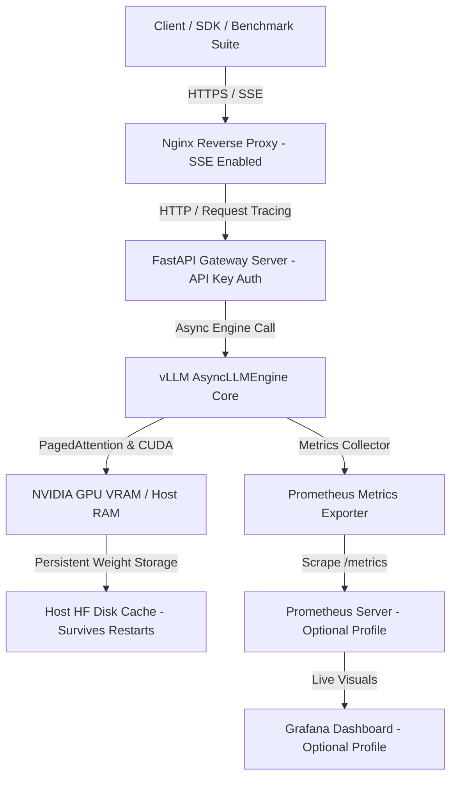

# Enterprise vLLM Production Inference Platform (GCP MLOps Blueprint)

A production-grade, highly reliable, cost-optimized LLM inference platform built to serve quantized open-source language models using **vLLM (`AsyncLLMEngine`)** on Google Cloud Platform (GCP) GPU VMs or local CPU/GPU environments.

Features an **OpenAI-compatible REST/SSE streaming API (FastAPI)** with API Key authentication, **Docker Profiles**, **Nginx reverse proxy**, **Prometheus & Grafana observability**, and **asynchronous load benchmarking**.

---

## 🏛️ System Architecture



---

## 📁 Repository Structure

```
d:/Edutainer/vLLM/
├── app/
│   ├── main.py              # FastAPI entrypoint, lifespan manager, CORS, request tracing, health probes
│   ├── config.py            # Comprehensive runtime parameters & environment variables
│   ├── engine.py            # AsyncLLMEngine core wrapper with SSE streaming & TTFT/TPOT metrics
│   ├── router.py            # OpenAI API routes (/v1/chat/completions, /v1/models) with API key auth
│   ├── metrics.py           # Custom Prometheus metrics definitions (TTFT, TPOT, KV Cache %)
│   └── schemas.py           # Pydantic schemas matching OpenAI ChatCompletion format
├── docker/
│   ├── Dockerfile           # Multi-stage CUDA 12.1 GPU Dockerfile
│   ├── Dockerfile.cpu       # Multi-stage CPU Dockerfile for local development
│   └── docker-compose.yml   # Orchestrator with Docker Profiles (default, monitoring, exporters)
├── nginx/
│   └── nginx.conf           # Enterprise Nginx proxy (proxy_buffering off, rate limiting, keepalives)
├── monitoring/
│   ├── prometheus/
│   │   └── prometheus.yml   # Prometheus scraper configuration
│   └── grafana/
│       └── dashboards/
│           └── llm_performance.json # Production Grafana dashboard layout
├── benchmarks/
│   ├── benchmark_load.py    # Async multi-concurrency load generator measuring TTFT & TPOT
│   └── payload.json         # Benchmark prompt payload
├── gcp/
│   ├── setup_vm.sh          # Idempotent GCP VM setup (CUDA, Docker, Toolkit, Systemd Auto-Recovery)
│   ├── deploy_vm.sh         # Deployment script with Docker profiles & model flags
│   ├── deploy_cloud_run.sh  # Deployment script for GCP Cloud Run serverless GPU
│   ├── update.sh            # Safe update script preserving HF model cache
│   ├── backup.sh            # Backup configuration script
│   └── cleanup.sh           # Resource cleanup script preserving model weights
├── docs/
│   ├── MASTER_GUIDE.md      # Master MLOps Infrastructure Handbook
│   ├── GCP_VM_GUIDE.md      # Step-by-step GCP Compute Engine GPU VM handbook
│   └── CLOUD_RUN_GUIDE.md   # Step-by-step GCP Cloud Run GPU handbook
└── README.md                # Primary project README
```

---

## 💰 GCP Cost Matrix & Hardware Selection

| Deployment Option | GPU & Machine Specs | On-Demand Cost | Spot VM Cost | Recommended Use Case |
| :--- | :--- | :--- | :--- | :--- |
| **GCP T4 GPU VM** | 1x NVIDIA T4 (16GB) + `n1-standard-4` | ~$0.50 / hr | **~$0.18 / hr** | Budget development & 7B AWQ model testing |
| **GCP L4 GPU VM** | 1x NVIDIA L4 (24GB) + `g2-standard-4` | ~$0.70 / hr | **~$0.24 / hr** | High throughput production & 8B FP8 serving |
| **GCP Cloud Run GPU**| 1x NVIDIA L4 (Serverless) | ~$0.65 / hr | Scale to 0 ($0) | Low-concurrency APIs with scale-to-zero |

---

## 🚀 Deployment & Operations

### 1. Provision GPU VM on GCP
```bash
gcloud compute instances create vllm-gpu-server \
    --zone=us-central1-a \
    --machine-type=g2-standard-4 \
    --accelerator=count=1,type=nvidia-l4 \
    --maintenance-policy=TERMINATE \
    --image-family=ubuntu-2204-lts \
    --image-project=ubuntu-os-cloud \
    --boot-disk-size=100GB \
    --boot-disk-type=pd-balanced \
    --tags=http-server,https-server
```

### 2. Environment Setup & Auto-Recovery Service
```bash
gcloud compute ssh vllm-gpu-server --zone=us-central1-a
cd vLLM
bash gcp/setup_vm.sh
```

### 3. Deploy Platform (API-Only vs Full Monitoring)
```bash
# Deploy API + Nginx (Minimum RAM/CPU footprint for lowest cost)
bash gcp/deploy_vm.sh "Qwen/Qwen2.5-0.5B-Instruct" "" ""

# Deploy API + Nginx + Prometheus + Grafana Observability
bash gcp/deploy_vm.sh "Qwen/Qwen2.5-0.5B-Instruct" "" "monitoring"
```

---

## 🧪 Benchmarking under Concurrency

Run the async load test generator to measure empirical **TTFT**, **TPOT**, and **Tokens/Second**:
```bash
python benchmarks/benchmark_load.py --url http://localhost/v1/chat/completions --concurrency 10 --requests 50
```

---

## 📚 Technical Handbooks

* 📖 [Master MLOps Infrastructure Handbook](file:///d:/Edutainer/vLLM/docs/MASTER_GUIDE.md)
* 🖥️ [GCP Compute Engine GPU VM Setup Handbook](file:///d:/Edutainer/vLLM/docs/GCP_VM_GUIDE.md)
* ☁️ [GCP Cloud Run GPU Setup Handbook](file:///d:/Edutainer/vLLM/docs/CLOUD_RUN_GUIDE.md)
